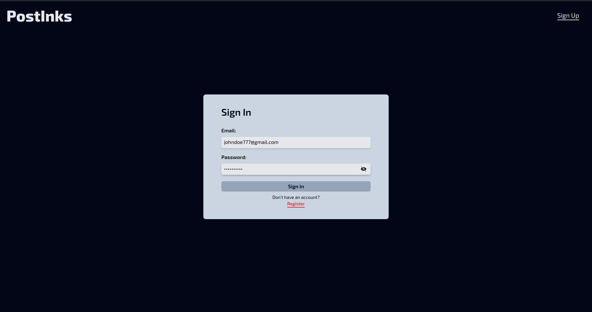
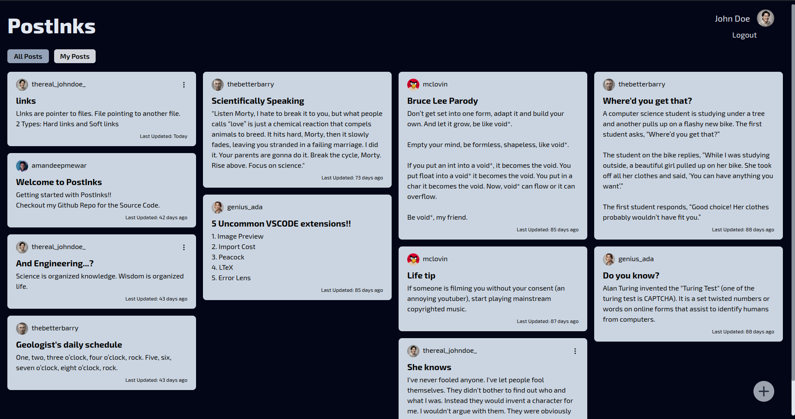

# PostInks Notes Application

PostInks Notes Application is a full-stack micro-blogging platform developed using the MERN stack. It allows users to create, read, update, and delete their short notes or microblogs, making it easy for people to share and discover new ideas.





## Demo

🔴 [Live Demo](https://postinksx-crud.netlify.app/)

## Table of Contents

- [Features](#features)
- [Technologies Used](#technologies-used)
- [Setup](#setup)
- [Usage](#usage)
- [Deployment](#deployment)
- [License](#license)

## Features

- User authentication with JWT
- Create, read, update, and delete posts
- View posts from all users
- Responsive and modern UI with Tailwind CSS

## Technologies Used

- **Frontend**: React.js, React Router, Tailwind CSS
- **Backend**: Node.js, Express.js, MongoDB Atlas
- **Authentication**: JWT (JSON Web Token)
- **Deployment**: Netlify (Frontend), Render (Backend)

## Setup

1. Clone the repository:
   ```sh
   git clone https://github.com/amandeepmewar/postinks-notes-app.git
   ```
2. Navigate to the project directory:

   ```
   cd postinks-notes-app
   ```

3. Install backend dependencies:

   ```
   cd backend
   npm install
   ```

4. Install frontend dependencies:

   ```
   cd ../frontend
   npm install
   ```

5. Set up environment variables:

- Create a .env file in the backend directory with the following variables:

  ```
  NODE_ENV=development
  PORT=3000

  MONGODB_URL=<MONGODB_URI>
  MONGODB_PASSWORD=<MONGODB_PASSWORD>
  MONGODB_USERNAME=<MONGODB_USERNAME>

  JWT_SECRET=<JWT_SECRET>
  JWT_EXPIRES_IN=90d
  JWT_COOKIE_EXPIRES_IN=90

  CLOUDINARY_CLOUD_NAME=<CLOUDINARY_CLOUD_NAME>
  CLOUDINARY_API_KEY=<CLOUDINARY_API_KEY>
  CLOUDINARY_API_SECRET=<CLOUDINARY_API_SECRET>
  ```

6.  Run the backend server:

    ```
    cd backend
    npm run dev
    ```

7.  Run the frontend development server:
    ```
    cd ../frontend
    npm run dev
    ```

## Usage

- Access the application at http://localhost:3000
- Sign up for an account or log in with existing credentials
- Create, view, update, and delete posts

## Deployment

- Frontend: Deployed on [Netlify](https://postinksx-crud.netlify.app/)
- Backend: Deployed on [Render](https://postinks-notes-app.onrender.com)

## License

This project is licensed under the MIT License.
